Basic Concepts
==============

The terminology to describe `unpaper` makes heavy use of the paper
metaphor, because the software is mainly intended for post-processing
scanned images from printed paper documents.

## Sheets and Pages

The very basic object `unpaper` operates on is a **sheet**. A *sheet*
is an initially blank image in the computer's memory. Think of a
*sheet* as an initially empty piece of paper on which something will
be printed later.

To do something useful with a *sheet*, you will at least want to place
one **page** onto a *sheet*. A *page* is a logical unit of a document
which takes up a rectangular area on a *sheet*. In the most simple
case, one *sheet* carries exactly one *page*, in other cases
(e.g. when using a double-page *layout*) there can be multiple *pages*
placed on one *sheet*.

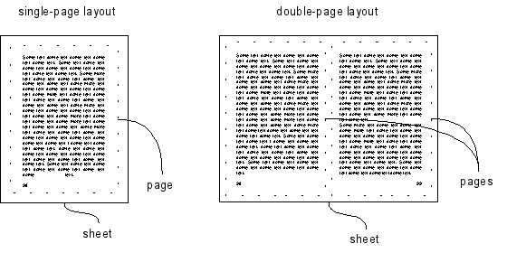

## Input and Output Image Files

`unpaper` can process either double-page *layout* scans or
individually scanned *pages*. It is up to the user's choice whether an
**image-file** carries a single *page* or a whole *sheet* with two
*pages*.  The program can be configured to either join individual
*image-files* as multiple *pages* onto one *sheet*, or split *sheets*
containing multiple *pages* into several output *image-files* when
saving the output.

By default, `unpaper` places one input *image-file* onto a *sheet*,
and saves one output *image-file* per *sheet*.  Alternatively, the
number of input or output *image-files* per *sheet* can be set to two
using the `--input-pages 2` or `--output-pages 2` options.

If two *image-files* are specified as input, they will successively be
placed on the left-hand half and the right-hand half of the
*sheet*.

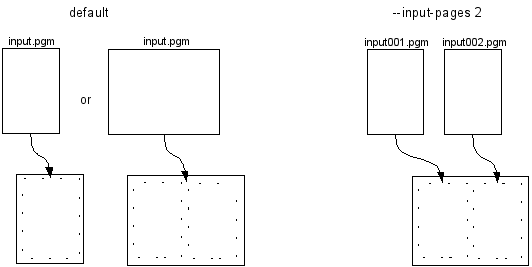

In the same way, if two *image-files* are specified as output, the
*sheet* will be split into two halves which get saved as individual
files.

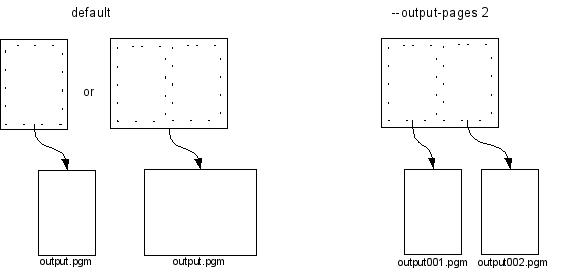

The default value both for `--input-pages` and `--output-pages` is 1.

### File Formats

The *image-file* formats accepted by `unpaper` are those that
[libav](http://libav.org) can handle. In particular it supports the
whole PNM-family: **PBM**, **PGM** and **PPM**. This ensures
interoperability with the [SANE](http://www.sane-project.org/) tools
under Linux. Support for TIFF and other complex file formats is not
guaranteed.

The output format is restricted to the PNM family of formats, and
conversions to other formats need to happen with tools such as
`pnmtopng`, `pnmtotiff` or `pnmtojpeg`. Alternatively you can use the
`convert` tool from [ImageMagick](http://www.imagemagick.org/).

## Layouts and Templates

### Built-In Layout-Templates

**Layouts** are the linking concept between physical *sheets* and
logical *pages*. A *layout* determines a set of rectangular areas at
which *pages* (or other parts of content) appear on a *sheet*. The
most common and simple *layouts* generally used are the single-page
*layout* (one *page* covers the whole *sheet*), and the double-page
*layout* (two *pages* are placed on the left-hand-side and the
right-hand-side of the *sheet*).

`unpaper` provides basic **layout templates** for the above types.
There are 2 *layout templates* built in, a third one deactivates any
template:

 * `single`
 * `double`
 * `none`

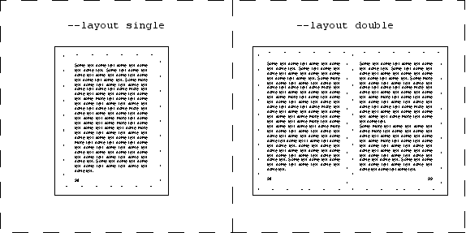

A *layout template* is chosen by using the option `--layout`, e.g.

    unpaper --layout double input%03d.pbm output%03d.pbm

Choosing a *template* with the `--layout` option is equivalent to
specifying a set of other options, e.g. setting `--mask-scan-point`.
In order to combine a *template* with other options, make sure that
the more specific options appear behind the `--layout` option, in
order to overwrite the *template* settings.

The default template is `single`, use `none` to deactivate this.

**Note**: A *layout* is completely independent from the number of
 *image-files* used as input or output. That means, you can either
specify `--layout double` together with a single input *image-file*
(in cases where the input *image-file* already contains two scanned
*pages* in a double-page *layout*), or use it together with an
`--input-pages 2` setting, in order to join two individually scanned
*pages* on one *sheet*.

### Complex Layouts

Besides the built-in fixed *templates*, any kind of complex *layout*
can be handled by manually specifying either *mask-scan-points* using
the `--mask-scan-point` option, or setting *masks* at fixed
coordinates using the `--mask` option. Both the `--mask-scan-point`
and the `--mask` option may occur any number of times, in order to
declare as many *masks* in the *layout* as desired. See below for a
further explanation on *masks*.

## Processing Multiple Files

In many cases, especially when post-processing scanned books, there
will be several input *image-files* to process in sequence within a
single run of `unpaper`, and several output *image-files* to be
generated.  Processing of multiple files in a batch job is supported
through the use of wildcards in filenames, e.g.:

    unpaper (...options...) input%03d.pbm output%03.pbm

This will successively read images from files `input001.pbm`,
`input002.pbm`, `input003.pbm` etc., and write output to the files
`output001.pbm`, `output002.pbm`, `output003.pbm` etc., until no more
input *image-files* with the current index number are available.

Using a wildcard of the form `%0nd` will replace each occurrence of
the wildcard with an increasing index number, by default starting with
1 and counting up by 1 each time another files gets loaded. *n*
denotes the number of digits that the replaced number string is
supposed to have, and the *0* requests leading zeros. Thus "%03d" will
get replaced with strings in the sequence `001`, `002`, `003`
etc. This way, a sequence of images named e.g. `input001.pgm`,
`input002.pgm`, `input003.pgm`... can be specified.  There are two
separate index counters for input and output files which get increased
independently from each other.

Wildcards in filenames are also useful when combining a sequence of
individual *pages* onto double-page layouted *sheets*, or when
splitting double-page layouted *sheets* into individual output
files. When using two input or output *image-files* (by specifying
`--input-pages 2` or `--output-pages 2`) the index number replaced for
the wildcard will generally not be the same as the *sheet* number in
the processing sequence, but will grow twice as fast.

The following example will combine single-page *image-files* onto a
double-page *layout* *sheet*:

    unpaper -n --input-pages 2 singlepage%03d.pgm output%03d.pgm

This joins the input images `singlepage001.pgm` and
`singlepage002.pgm` on` output001.pgm`, `singlepage003.pgm` and
`singlepage004.pgm` on `output002.pgm`, and so on. Note that due to
the use of option `-n` (short for `--no-processing`), the images are
simply copied onto the left-hand half and the right-hand half of the
*sheet* without any processing regarding *layout*, *mask-detection*
etc.

Using multiple input *image-files* by setting `--input-pages 2` is
independent from any *layout* possibly specified with the `--layout`
option. However, in order to use `unpaper`'s post-processing features
for more than simply joining two *image-files* to one, you will most
likely want to combine the use of `--input-pages 2` with the `--layout
double` option, as in:

    unpaper --layout double --input-pages 2 (...other options...) singlepage%03d.pgm output%03d.pgm

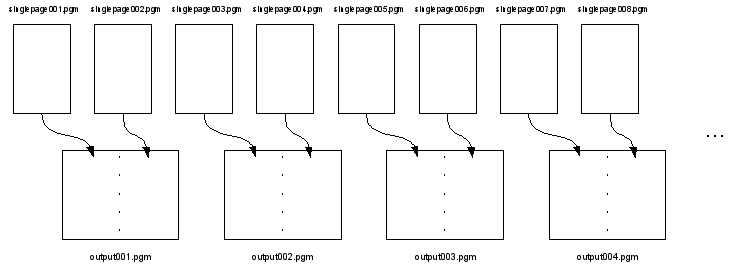

Similarly, it is also possible to split up a *sheet* into several
*image-files* when saving. The following line would be used to split
up a sequence of double-page layouted *sheets* into a sequence of
single-page output images, including full image processing (applying
*masking*, *deskewing*, *border-aligning* etc., see below) in order to
make sure that the *pages* in the double-page *layout* are really
placed fully on the left-hand half and the right-hand half of the
*sheet* before the *sheet* gets split up:

    unpaper --layout double (...options...) --output-pages 2 doublepage%03d.pgm singlepage%03d.pgm

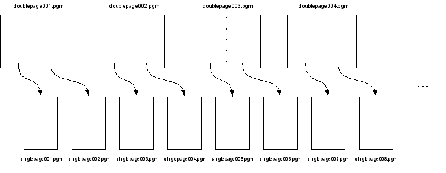

By default, processing of multiple *sheets* starts with *sheet* number
1, and also with input and output *image-files* number 1. `unpaper`
will run as long as input *image-files* with the current index number
can be found. If no more input files are available, processing stops.

### Adjusting Indices

In order to start with a different *sheet* index, the `--start-sheet`
option can be set. Likewise, setting `--end-sheet` specifies a fix
*sheet* number that will the last one processed, even if more
input-files are available.

Using `--sheet`, a single *sheet* or a set of specific *sheet* numbers
to be processed can be specified. For example:

    unpaper --sheet 7,12-15,31 --input-pages 2 (...options...) input%03d.pgm output%03d.pgm

This would generate the output-files `output007.pgm`, `output012.pgm`,
`output013.pgm`, `output014.pgm`, `output015.pgm` and `output031.pgm`,
reading input from the same files as if a whole sequence of *sheets*
and *pages* starting with index 1 had been processed, i.e. reading the
files `input013.pgm` and `input014.pgm` for *sheet* 7, `input023.pgm`
and `input024.pgm` for *sheet* 12, and so on.

To prevent some *sheets* from being processed (i.e., remove them from
the sequence), the option `--exclude` can be used. Note that this is
different from option `--no-processing` or `-n`, which still would
generate the output files but without applying any image processing to
them.

The input and output index numbers to start with can be adjusted using
the options `--start-input` and `--start-output`.  These values apply
to the wildcard replacement in filenames only and are independent from
the *sheet* numbering. In other words, setting these options specifies
an offset at which the file numbering starts relative to
*sheet* 1. For example:

 unpaper --input-pages 2 (...options...) --start-input 7 input%03d.pgm output%03d.pgm

These settings would cause the input-files `input007.pgm` and
`input008.pgm` to be used for *sheet* 1, `input009.pgm` and
`input010.pgm` for *sheet* 2, and so on. The default value for both
options is 1.

### File-Sequence Patterns

More sophisticated **file-sequence patterns** can be specified using
the `--input-file-sequence` or `--output-file-sequence` options. In
cases where the input files are named after a pattern like
e.g. `left01.pbm`, `right01.pbm`, `left02.pbm`, `right02.pbm` etc.,
the use of `--input-pages 2` together with `--input-file-sequence
left%02d.pbm right%02d.pbm` will load to the desired images. The index
counter with which the wildcards in the filenames get replaced is
increased every time the *file-sequence pattern* is iterated through,
it will not be increased after each single replacement of a wildcard.

Note that it would also be possible to use *file-sequence patterns* of
different lengths than the number of *pages* per *sheet*.  In case an
input *file-sequence* like e.g. `a%d.pbm b%d.pbm c%d.pbm` is specified
together with `--input-pages 2`, the input *image-files* used for the
first *sheet* would be `a1.pbm` and `b1.pbm`, the input *image-files*
used for the second *sheet* would be `c1.pbm` and `a2.pbm` (!), for
the third *sheet* they would be `b2.pbm` and `c2.pbm`, and so on. It's
up to the user whether it makes sense to use *file-sequence patterns*
of different length than the corresponding number of input
*image-files* or output *image-files* per *sheet*.

Specifying a filename as the very last argument on the command-line is
equivalent to using `--output-file-sequence <file>` (a sequence of
length 1), specifying a filename as the last-but-one argument on the
command line is equivalent to using `--input-file-sequence <file>`.

### Inserting Blank Content

Input *file-sequences* may be forced to use completely blank images at
some index positions. The `--insert-blank` option allows to specify
one or more input indices at which no file is read, but instead a
blank image is inserted into the sequence of input images. The input
image that would have been loaded at this index position in the
sequence will be used at the following non-blank index position
instead, thus the following indices get shifted to make room for the
blank image inserted.

The `--replace-blank` option also allows to insert blank images into
the sequence, but it suppresses the images that would have been loaded
at the specified index positions and ignores them. No index positions
get shifted to make room for the blank image.

## Masks

**Masks** are rectangular areas on a *sheet* that are affected by
several of the processing steps `unpaper` performs.  Although there
may be as many *masks* on a *sheet* as desired, in most cases it will
be useful to operate with either one or two *masks* per *sheet*
only. A single-page *layout* would operate on only one *mask* covering
the whole *page*, a double-page *layout* would make use of two
*masks*, one placed somewhere in the left-hand half of a *sheet*, the
other somewhere in the right-hand half.

### Automatic Mask-Detection

*Masks* can be set directly by specifying pixel coordinates using the
`--mask` option, but in most cases it is desirable to detect *masks*
automatically. Automatic **mask-detection** allows input images to
contain content which is not perfectly placed at fix areas, but
probably differs slightly in position from *sheet* to *sheet* (which
is usually the case when books are scanned or photocopied manually).

Automatic *mask-detection* uses a starting point somewhere on the
*sheet* called **mask-scan-point**, which marks a position estimated
to be somewhere inside the *mask* to be detected. (When detecting
*masks* that cover a whole *page*, it is useful to place the
*mask-scan-point* right in the center of the *sheet*'s half on which
the *page* appears.) Beginning from the *mask-scan-point*, the image
content is virtually scanned in either the two horizontal directions
(left and right), or the two vertical directions (up and down), or all
four directions, until no more dark pixels are found which means an
edge of the *mask* is considered to have been found.

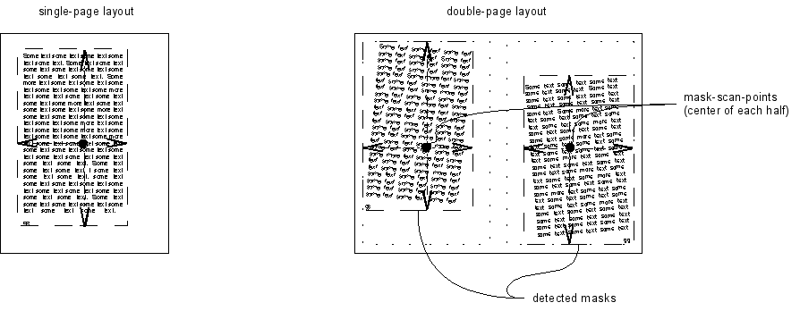

Several parameters control the process of *mask-detection*. At first,
*mask-scan-points* to start detection at get specified either using
the `--layout` option (which automatically sets one *mask-scan-point*
for single-page *layouts*, and two *mask-scan-points* for double-page
*layouts*) or manually with the option `--mask-scan-point`.

*Mask-detection* is performed by the use of a 'virtual bar' which
covers an area of the *sheet* under which the number of dark pixels is
counted.  The 'virtual bar' is moved towards the directions specified
by `--mask-scan-direction`.  (Those directions not given via
`--mask-scan-direction` will use up the whole *sheet*'s size in these
directions for the detected result.)

While moving the 'virtual bar' the number of dark pixels below it is
continually compared to the number that has been counted at the very
first position of the 'virtual bar' above the *mask-scan-point* when
detection started. Once the number of dark pixels drops below the
relative value given by `--mask-scan-threshold`, *mask-detection*
stops and an edge of the *mask* is considered to have been found.

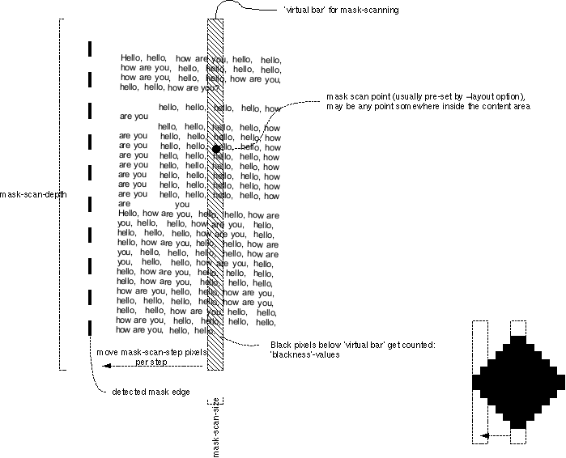

The width of the 'virtual bar' can be configured using the
`--mask-scan-size` option, the length of it by setting
`--mask-scan-depth`.  Adjusting the 'virtual bar's' width can help to
fine-tune the process of mask detection according to the content that
is being scanned. The wider the 'virtual bar' is, the more tolerant
the detection process becomes with respect to small gaps in the
content (which is e.g. needed if a *page* is made up of multiple
columns). However, if the 'virtual bar' is too wide, detection might
not stop properly when a mask's edge should have been found.

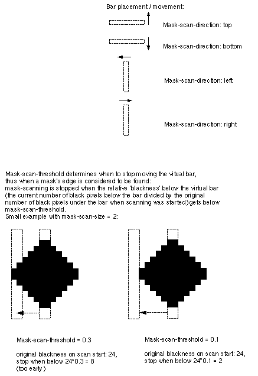

*Mask-detection* can be disabled using the `--no-mask-scan` option,
optionally followed by the *sheet* numbers to disable the filter for.

### Mask-Centering

*Masks* that have been automatically detected or manually set will be
used for several further processing steps. At first they provide the
basis for properly centering the content on the corresponding *page*
area on the *sheet*.

This allows `unpaper` to automatically correct imprecise positions of
*page* content in scanned *sheets* and shift the content to a
normalized position. Especially when processing multiple *pages*, this
leads to more regular positions of *pages* in the sequence of
resulting *sheets*.

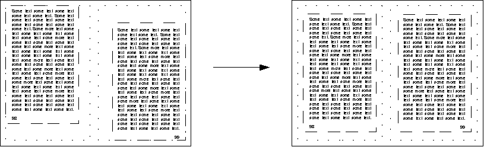

*Mask-centering* can be suppressed using `--no-mask-center`,
optionally followed by the *sheet* numbers to disable the filter for.

## Borders

Unlike *masks*, **borders** are detected by starting at the outer
edges of the *sheet* (or left/right halves of the *sheet*, in a
double-page *layout*), and then scanning towards the middle until some
content-pixels are reached. Again, a 'virtual bar' is used for
detection, the width of which can be set using the option
`--border-scan-size`, and the step-distance with which to move it by
setting the option `--border-scan-step`. The option
`--border-scan-threshold` determines the maximum absolute number of
pixels which are tolerated to be found below the 'virtual bar' until
*border-detection* stops and one edge of the *border* area is
considered to have been found.

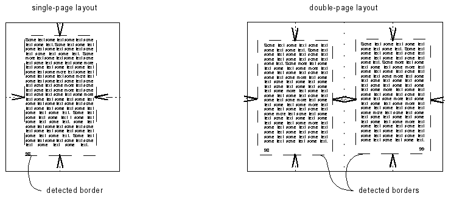

### Border-Aligning

*Borders* serve two different purposes: First, the area outside the
detected *border* on the *sheet* will be wiped out, which is another
mechanism to clean the outer *sheet* boundary from unwanted pixels.

Second, a detected *border* can optionally be aligned towards one edge
of the *sheet*. **Border-aligning** means shifting the area inside the
*border* towards one edge of the *sheet*.  The edge towards which to
shift the border is specified with the option `--border-align`.
Additionally, a fixed distance from the edge is kept, which can be set
via `--border-margin`.

This way, it can be assured that e.g. all *pages* of a scanned book
regularly start 2 cm below the upper *sheet* edge.

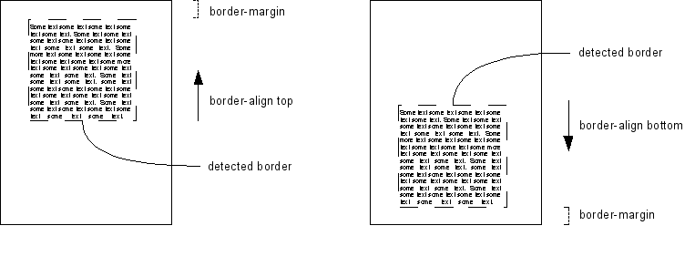

Note that *border-aligning* is not performed by default, it needs to
be explicitly activated by setting the option `--border-align` to one
of the edge names `top`, `bottom`, `left` or `right`, and by setting
`--border-margin` to the desired distance which is to be kept to this
edge.

Use `--no-border-scan `to disable *border-detection*, or
`--no-border-align` to prevent *border-aligning* on specific *sheets*,
both optionally followed by the *sheet* numbers to disable the filters
for.

## Size Values

Whenever an option expects a **size** value, there are three possible
ways to specify that:

 * as absolute pixel values, e.g. `--sheet-size 4000,3000`
 * as length measurements on one of the scales `cm`, `mm`, `in`,
    e.g. `--size 30cm,20cm` or also `--size 10in,250mm`
 * using one of the following *size* names:
   - `a5`
   - `a4`
   - `a3`
   - `letter`
   - `legal`
   - `a5-landscape` (horizontally oriented A5)
   - `a4-landscape` (horizontally oriented A4)
   - `a3-landscape` (horizontally oriented A3)
   - `letter-landscape` (horizontally oriented letter)
   - `legal-landscape` (horizontally oriented legal)
   Examples: `--sheet-size a4`, `--post-zoom letter``-landscape`

Using one of the last two ways, length measurements get internally
converted to absolute pixel values based on the resolution set via the
option `--dpi`. If the default of 300 DPI should be changed, this
option must appear on the command line before using a length
measurement value. `--dpi` may also appear multiple times, e.g. if the
*size* values of the output image(s) should be based on a different
resolution than those of the input file(s).

Note that using the `--dpi` option will have no effect on the
resolution of the *image-files* that get written as output. (The PNM
format is not capable of storing information about the image
resolution.) The value set via `--dpi` will only have effect on
`unpaper`'s internal conversion of length measurements to absolute
pixel values when *size* values are specified using length
measurements or *size* names.
