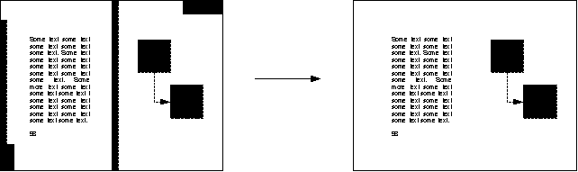
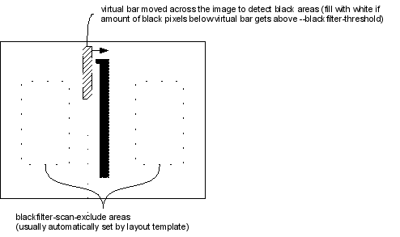
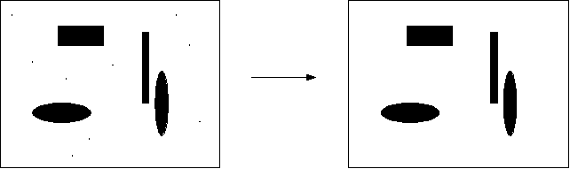
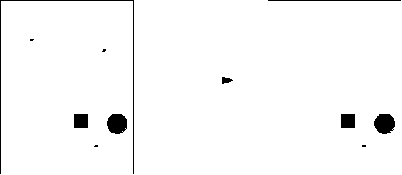
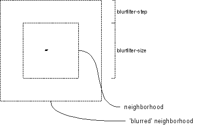
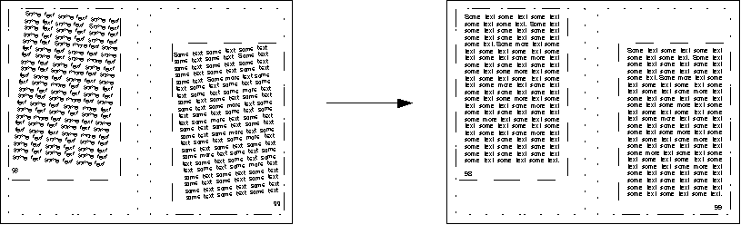
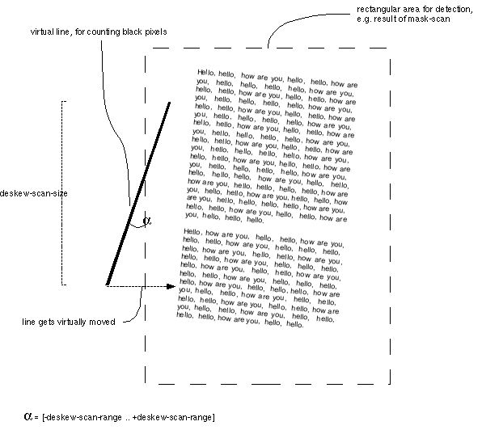
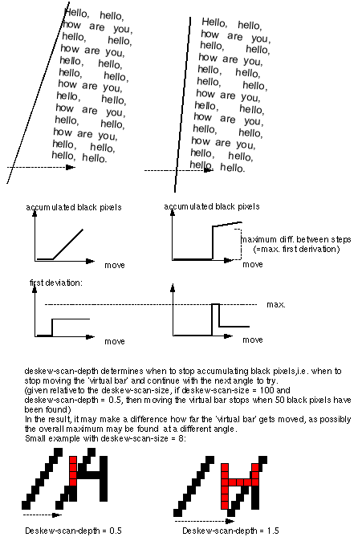
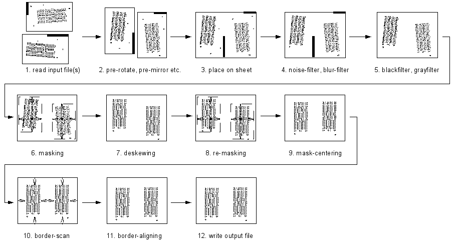

Image Processing Features
=========================

## Blackfilter

Sometimes it is desirable to automatically remove large black areas
which originate from bad photocopies or other optical influences. The
**blackfilter** can help to find large areas of black and wipe them
out automatically.

Be careful with pictures in scanned documents, especially with
diagrams. Some diagrams intentionally contain large areas of dark
color, which might be affected by automatic wipe-out of the
*blackfilter*. In order to prevent actual *page* content from being
wiped out, the option `--blackfilter-scan-exclude` allows to specify
areas on the *sheet* which should not be taken into account by the
*blackfilter*. When using one of the default *layout templates* set
via the `--layout` option, the inner area of each *page* will
automatically be excluded from black-filtering.

The *blackfilter* can be disabled by the option `--no-blackfilter`,
optionally followed by the *sheet* numbers to disable the filter for.

## Noisefilter

The **noisefilter** removes small clusters of pixels ("noise") from
the *sheet*.  The maximum pixel-size of clusters to be removed can be
set via `--noisefilter-intensity`.  This value must not be chosen too
high in order not to remove relevant elements of *page* content,
e.g. normal text-points ("."). As a consequence, this option might
have to be adjusted on images with a low scan resolution.

Disable with `--no-noisefilter`, optionally followed by the *sheet*
numbers to disable the filter for.

## Blurfilter

The **blurfilter** removes "lonely" clusters of pixels, i.e. clusters
which have only very few other dark pixels in their neighborhood.

The size of the neighborhood to be searched and the amount of other
dark pixels accepted in the neighborhood below which the area gets
wiped out can be adjusted with the options `--blurfilter-size`,
`--blurfilter-step` and `--blurfilter-intensity`.  Additionally,
`--blurfilter-step` also determines the step-size with which the
neighborhood-area is moved across the image while filtering.

Disable with `--no-blurfilter`, optionally followed by the *sheet*
numbers to disable the filter for.

## Grayfilter

The **grayfilter** removes areas which are gray-only, that means it
wipes out all those areas which do not contain a maximum relative
amount of non-dark pixels. The size of the local area the *grayfilter*
operates on can be set using `--grayfilter-size`, and the granularity
of detection is controlled via `--grayfiter-step`.  The maximum
relative amount of non-dark pixels that are still considered to be
deletable can be set using `--grayfilter-threshold`.

Be careful with the *grayfilter* when processing color scans, because
any bright color might be considered as gray and be wiped out. It
might be a good idea to disable the *grayfilter* when processing color
scans.

Disable with `--no-grayfilter`, optionally followed by the *sheet*
numbers to disable the filter for.

## Deskewing (Auto-Straightening)

The *deskewing* performed by `unpaper` is actually a rotation to
automatically straighten rectangular content areas on the *sheet*.  It
is applied to any *mask* that has been found during *mask-detection*
or that has been set directly via the `--mask` option.

The algorithm that detects the angle of skew works better the more
regular and solid the edges of the area's content are.  It works as
follows: A 'virtual line' is moved from the outside of one edge inside
the rectangular area. This happens several times, gradually changing
the rotation of the 'virtual line'. (Called 'virtual', because there
is of course no visible line drawn in the image.) The algorithm will
count the number of dark pixels along the line as it is virtually
moved.

Some parameters control the the size of the 'virtual line' and its
movement: `--deskew-scan-size`: the height/width of the 'virtual line'
used for scanning (the length of the line at rotation angle 0)
`--deskew-scan-range`: the absolute value of degrees between the
negative and positive value of which the line will be rotated (i.e.,
the default value 5.0 will cause the 'virtual line' to be rotated in
several small steps between -5.0 degrees and 5.0 degrees).
`--deskew-scan-step`: the step size with which to iterate between the
bounds set by `--deskew-scan-range` (I.e., a value of 0.1 will lead to
the virtual line being successively rotated with
0.0, 0.1, -0.1, 0.2, -0.2, 0.3, -0.3 ... degrees.)

At each of these rotation steps, the following is done: The rotated
'virtual line' gets moved (again 'moved virtually') towards the center
of the rectangular area on which detection gets performed.  Movement
is performed pixel by pixel, it starts with the line completely
outside the rectangular area, not yet reaching inside the area. At
each movement-step, the number of dark pixels covered by the virtual
line is counted and is accumulated as the total sum of dark
pixels. For each rotation angle at which this is done, the maximum
difference in the accumulated sum of dark pixels occurring between a
previous movement-step and the next one gets calculated. The rotation
angle for which this maximum difference becomes maximal will be the
rotation angle detected for *deskewing*.

The relative amount of dark pixels to accumulate before shifting the
'virtual line' is stopped (and continued with the next rotation-step)
is given by `--deskew-scan-depth`.  This value is relative to the
number of pixels that the 'virtual line' covers in total, i.e.  for
the default deskew-scan-size of 1500 and the default deskew-scan-depth
of 0.66, shifting at each rotation step stops after 1000 dark pixels
have been counted in sum (or, if not enough pixels are met, when the
'virtual line' has reached the center of the rectangular area).

Sometimes, trying out different deskew-scan-depth values, either lower
than the default of 0.66, or higher, can noticeably increase detection
quality. Which value is best is merely coincidental, depending on the
shape of the outer edges of each very first character in each line of
a text area.

The above described the detection process starting at one single edge
of a 4-edged rectangular area (e.g. the left edge, as displayed in the
above image).  However, the overall rotation angle detection uses
results of up to all four edges. Which edges to use can be specified
by `--deskew-scan-direction`.  The final rotation angle will then be
the average value of all rotation angles detected at each
edge. Usually, the individually detected values can be expected to be
almost the same at each edge, if the rectangular area to be deskewed
has a regular shape. If, however, the individual values differ too
much, it can be concluded that something went wrong with the
detection, and no *deskewing* should be performed. (E.g., if the
rotation at the left edge appears to be -0.5 degrees, but at the right
edge results in 1.9 degrees, one should better not use the average
value, because with that big difference something seems to have gone
wrong with the detection.)  So, before using the average of all
individually detected values, their statistical standard-deviation is
calculated, which is √((a-average)² + (b-average)² + ...).

If the standard-deviation among the detected angles exceeds the value
specified by `--deskew-scan-deviation`, the total result is considered
to be wrong and no *deskewing* is performed.

*Deskewing* can be disabled with `--no-deskew`, optionally followed by
the *sheet* numbers to disable it for.

## Processing Order

Processing of the filters and auto-corrections is performed in a fixed
order according to the following sequence:

 1. **load** image file(s)
 2. perform **pre-rotate**, **pre-mirror** etc. actions on the
    individual input files (if specified)
 3. **place** on the sheet (multiple input-files are placed as tiles),
    auto-determine sheet size by the size of the input image-file(s)
    if not specified explicitly
 4. apply **noisefilter** and **blurfilter** to remove small bits of
    unwanted pixels
 5. apply **blackfilter** and **grayfilter** to remove larger areas of
    unwanted pixels
 6. detect **masks** starting from specified mask-scan-points
 7. perform **deskewing** on each detected or directly specified
    mask
 8. **re-detect masks** again to get precise masks after deskewing
 9. **center masks** on the corresponding page's area on the sheet
10. perform **border-detection**
11. **align** the detected borders
12. **save** output image file(s), possibly perform **post-rotate**,
    **post-mirror** etc. actions on the individual output files before
    saving

## Disabling Processing Steps

Each processing step can be disabled individually by a corresponding
`--no-xxx` option (where `xxx` stands for the feature to disable,
e.g. `--no-grayfilter`, `--no-mask-scan` etc.).  If such an option is
followed by a *sheet* number, or a comma-separated list of multiple
*sheet* numbers, the filter gets disabled only for those *sheets*
specified. Otherwise (if no *sheet* number follows), the filter is
disabled for all *sheets*. Instead of specifying individual *sheet*
numbers, also a range of numbers can be given, e.g. "10-20" to
represent all *sheet* numbers between 10 and 20. Example:

    unpaper (...options...) --no-blackfilter 3,15,21-28,40 (...)

This will disable the *blackfilter* on the *sheets* 3, 15, 21, 22, 23,
etc. until 28, and 40.
